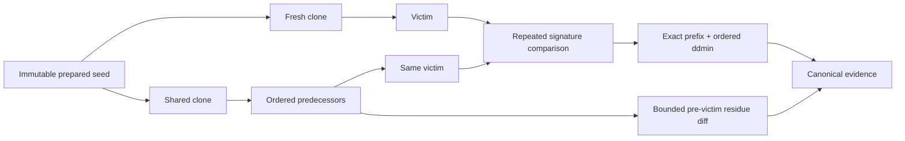

# GhostCase

GhostCase is a local, framework-agnostic differential debugger for order-dependent AI-agent eval state.

An agent eval can pass by itself and fail only after another case has left memory, checkpoints,
workspace files, caches, or local databases behind. Re-running the whole suite may reproduce the
failure without identifying the state-setting chain. GhostCase turns that failure into a bounded,
replayable counterfactual:

- run the victim in a fresh clone of one immutable seed;
- run the same victim after an ordered predecessor chain in another clone of that seed;
- repeat both arms until their oracle signatures are stable;
- find the first exact failing prefix, then minimize it with order-preserving `ddmin`; and
- record bounded filesystem residue between adapter setup and the victim.

GhostCase invokes your eval through an explicit command/argv contract. It does not require an LLM
judge, an API key, or adoption of a particular agent framework.

## Why this is a separate tool

The failure GhostCase targets sits between ordinary eval runners and ordinary flaky-test tools:

1. The unit of execution is an arbitrary local command, not a specific Python, Java, or agent SDK.
2. The counterfactual is fresh state versus inherited state from the same immutable seed.
3. A verdict requires repeated, identical semantic signatures rather than one lucky failure.
4. Minimization preserves manifest order and does not assume that longer prefixes fail
   monotonically.
5. The report couples the behavioral shift with bounded, path-redacted state residue.

`POLLUTION` means a victim passes fresh and fails after the minimized chain.
`HIDDEN_DEPENDENCY` is the inverse: it fails fresh and passes only after inherited state.
`OUTCOME_SHIFT` captures a stable semantic-signature change even when pass/fail stays the same.

## Install from source

GhostCase has not been published to npm. Use the repository source.

Requirements:

- Node.js `>=22.13.0`
- pnpm `11.5.0`

```sh
git clone https://github.com/getio0909/ghostcase.git
cd ghostcase
pnpm install --frozen-lockfile
pnpm build
```

Run the bundled deterministic memory-leak example:

```sh
node dist/cli/main.js validate examples/memory-leak/ghostcase.json
node dist/cli/main.js inspect examples/memory-leak/ghostcase.json
node dist/cli/main.js doctor examples/memory-leak/ghostcase.json
node dist/cli/main.js run examples/memory-leak/ghostcase.json --victim victim
```

The example's `polluter` case writes a persona into persistent state. The `victim` case passes from
a fresh clone and fails after that residue is inherited; `noise` is removed from the witness during
minimization. The run writes canonical evidence under `.ghostcase/evidence` unless
`--evidence-dir` selects another directory.

## Commands

```text
ghostcase validate [suite] [options]
ghostcase inspect [suite] [options]
ghostcase doctor [suite] [options]
ghostcase run [suite] [options]
ghostcase replay <evidence.json> [options]
```

The default suite path is `ghostcase.json`.

| Command    | What it does                                                                 |
| ---------- | ---------------------------------------------------------------------------- |
| `validate` | Validates strict JSON, semantics, fixtures, and isolation boundaries.        |
| `inspect`  | Shows safe digests, the resolved plan, argv counts, and search bounds.       |
| `doctor`   | Checks command resolution, cloning, and snapshots without running cases.     |
| `run`      | Searches for stable fresh/shared shifts and minimizes predecessor witnesses. |
| `replay`   | Re-runs the recorded fresh/shared witness without repeating the search.      |

Common options are `--format <format>`, `--output <path|->`, and `-v`/`--verbose`. `run` also
accepts repeatable `--victim <case-id>` and `--evidence-dir <path>`.

- `validate`, `inspect`, and `doctor`: `human` or `json`
- `run` and `replay`: `human`, `json`, `junit`, or `sarif`

The selected format is a projection of validated report data. A `run` always stores canonical
`ghostcase/evidence/v2` JSON separately. It binds the manifest and prepared seed digests plus a
versioned post-run snapshot of stable regular suite-relative files directly referenced as programs,
file stdin, or typed argv/environment values, and includes the portable relative locator needed by
`replay`.

That execution-input digest is intentionally direct, not recursive: PATH-resolved programs,
imports performed by a program, state/temp typed paths, state/temp working directories and oracle
paths, dynamic file stdin, and suite typed paths that are absent, uninspectable, or not regular
non-link files remain outside the digest. Evidence records a unique count for each unbound
reference class instead of claiming complete environment capture. Keep the suite tree private and
read-only during the run: a post-run snapshot cannot prove that a configured command did not mutate
its own suite files during earlier arms.

See [the suite format](docs/suite-format.md) for the complete schema, defaults, command merge
rules, oracles, search behavior, verdicts, and exit codes.

## What one arm actually does



Each materialized arm runs adapter setup, captures a baseline snapshot, runs the selected
predecessors, captures pre-victim residue, and then runs the victim. Adapter reset and workspace
cleanup run afterward. A predecessor whose own oracle does not pass invalidates that arm instead
of being treated as causal evidence.

## Verdicts

| Verdict             | Meaning                                                                      |
| ------------------- | ---------------------------------------------------------------------------- |
| `CLEAN`             | Fresh and shared arms have the same stable outcome and semantic signature.   |
| `POLLUTION`         | Fresh passes; shared fails.                                                  |
| `HIDDEN_DEPENDENCY` | Fresh fails; shared passes.                                                  |
| `OUTCOME_SHIFT`     | Pass/fail is unchanged, but the stable semantic signature changes.           |
| `NON_REPRODUCIBLE`  | Valid repetitions disagree.                                                  |
| `INCONCLUSIVE`      | Budget, platform, truncation, or incomplete valid runs prevent a conclusion. |
| `HARNESS_ERROR`     | No valid evidence was produced because setup, execution, or capture failed.  |

Reports intentionally omit raw stdout, stderr, environment values, and absolute host paths. They
retain suite/case IDs, digests, state-root aliases, change kinds, and deterministic subject IDs.
Those fields can still be sensitive; read [the security model](SECURITY.md) before sharing
evidence.

## Prior art and the scoped novelty claim

Public work already covers persistent-agent evaluation, order-dependency minimization, and
storage-residue auditing separately. In the primary sources reviewed below, we did not verify an
implementation that combines all three as a general command-level AI-eval debugger. That is a
scoped prior-art statement, not a claim of universal novelty.

| Project                                                                                                                               | Primary scope                                                                                                           | Relationship to GhostCase                                                                                                                                                                                                                                                                                                                               |
| ------------------------------------------------------------------------------------------------------------------------------------- | ----------------------------------------------------------------------------------------------------------------------- | ------------------------------------------------------------------------------------------------------------------------------------------------------------------------------------------------------------------------------------------------------------------------------------------------------------------------------------------------------- |
| [Letta Evals](https://github.com/letta-ai/letta-evals)                                                                                | Evaluation framework for stateful Letta agents, including repeat runs, memory extraction, and optional sandbox targets. | Broader eval authoring and grading; not a command-level predecessor-chain debugger with residue-backed minimization.                                                                                                                                                                                                                                    |
| [MemSecBench](https://arxiv.org/abs/2607.27080)                                                                                       | Controlled Write–Execute–Forget benchmark for persistent agent-memory poisoning and repair.                             | Benchmarks a security lifecycle across fixed stacks; GhostCase diagnoses an arbitrary local suite's order-dependent state.                                                                                                                                                                                                                              |
| [AgentFootprint](https://github.com/polyuiislab/AgentFootprint) ([paper](https://arxiv.org/abs/2607.11149))                           | Cross-framework measurement of post-run agent storage footprint.                                                        | Makes storage residue measurable; GhostCase additionally requires a stable fresh/shared behavioral shift and minimizes its ordered witness.                                                                                                                                                                                                             |
| [detect-test-pollution](https://github.com/asottile/detect-test-pollution)                                                            | Pytest pollution detection through shuffled failures and bisection.                                                     | Excellent runner-specific polluter search; GhostCase uses a strict command adapter, immutable state clones, semantic oracles, and evidence snapshots.                                                                                                                                                                                                   |
| [iDFlakies](https://github.com/UT-SE-Research/iDFlakies) / [iFixFlakies](https://github.com/TestingResearchIllinois/iFixFlakies)      | Java order-dependent test detection, minimization, and repair.                                                          | Important precedent: iFixFlakies already uses delta debugging on failing-order prefixes and helper statements ([paper](https://mir.cs.uiuc.edu/~marinov/publications/ShiETAL19iFixFlakies.pdf)). GhostCase does not claim to invent that technique; it applies ordered reduction to framework-neutral AI-eval commands and couples it to state residue. |
| [PolDet](https://github.com/poldet/poldet) ([paper](https://mir.cs.uiuc.edu/~marinov/publications/GyoriETAL15PollutionDetection.pdf)) | Proactive Java heap and filesystem pollution detection.                                                                 | Audits state mutation even before a victim manifests; GhostCase centers the observed victim counterfactual and emits a minimized reproducer.                                                                                                                                                                                                            |

## Boundaries

GhostCase is not:

- an OS sandbox or a safe way to execute untrusted programs;
- an LLM quality judge;
- a causal tracer for individual bytes, database rows, or network services;
- a test-order fuzzer for discovering arbitrary permutations; or
- proof that every earlier case was searched when `maxChainLength` truncates the candidate window.

The filesystem diff is supporting evidence for a reproducible behavioral counterfactual, not a
byte-level proof of causation. Commands can access the network, escape declared state roots, and
spawn children with the permissions of the GhostCase process. Use a disposable container or VM
for untrusted or high-risk evals. See [SECURITY.md](SECURITY.md).

## Development

```sh
pnpm format
pnpm check
pnpm package:smoke
```

CI exercises Node.js 22 and 24 on Windows and Ubuntu. Contributions target `main`; see
[CONTRIBUTING.md](CONTRIBUTING.md).

## License

MIT. See [LICENSE](LICENSE).
